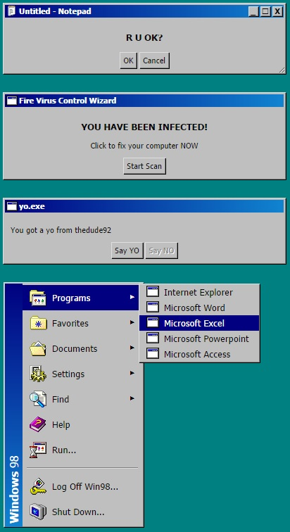

## windows_98.css

`npm install windows_98.css`

[Quick Demo Page](http://contra.io/windows_98.css)

If you would like to work on more controls or making existing ones look closer to Windows 98™ please send a PR!
